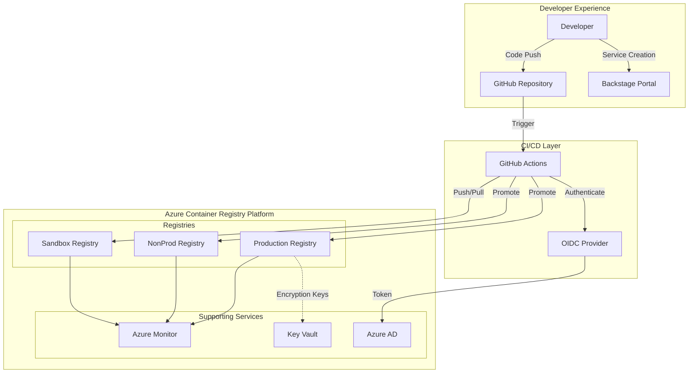
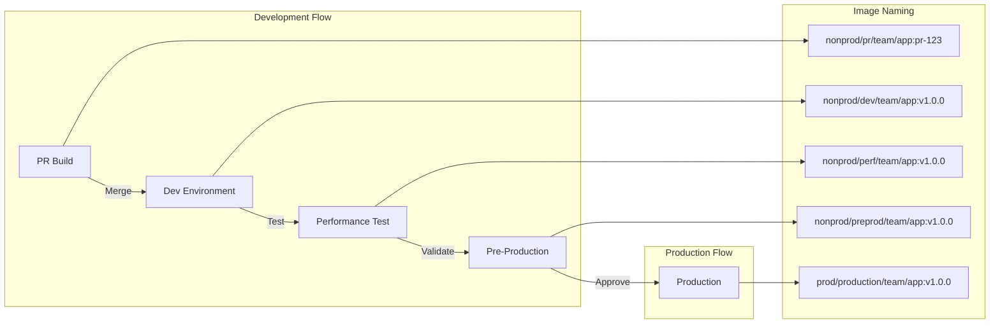
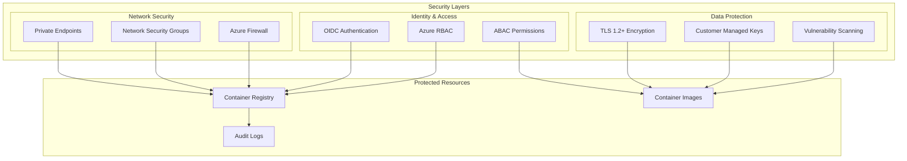
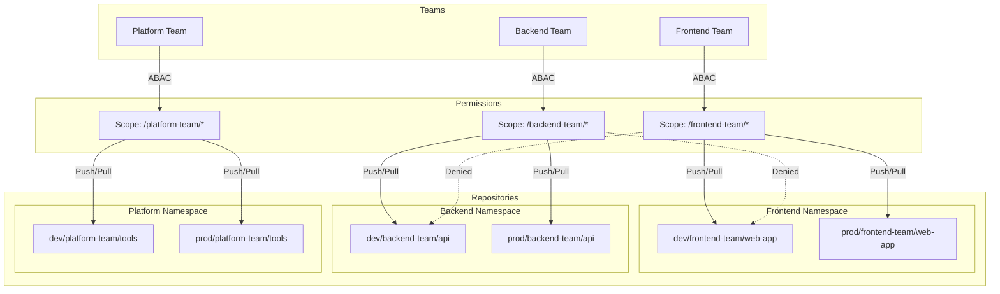
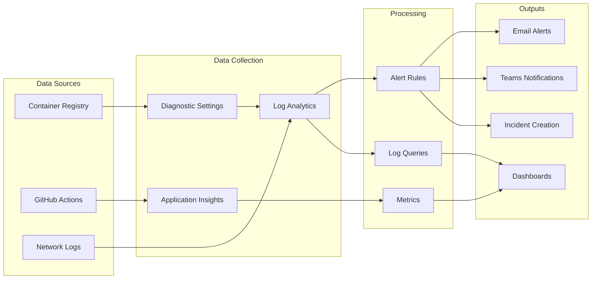
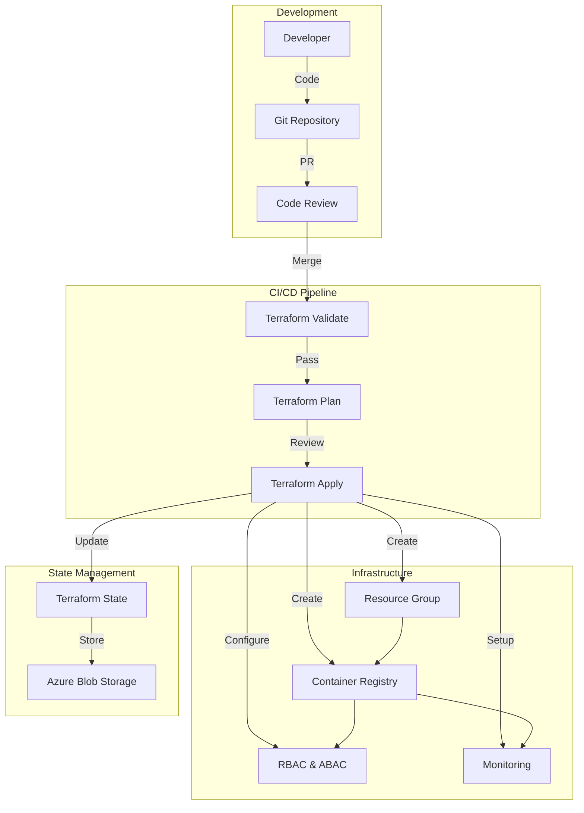
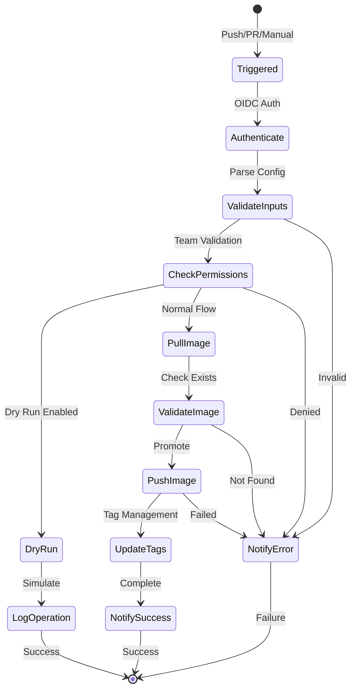
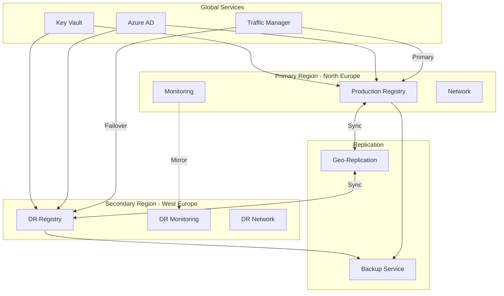
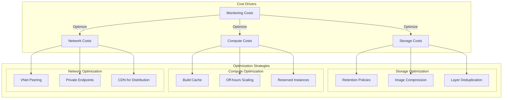
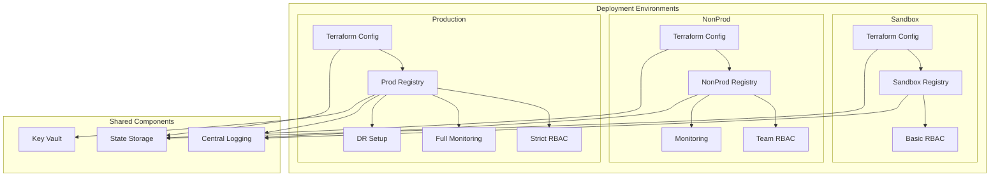

# BrightCloud Container Registry Platform - Architecture Diagrams

## 1. High-Level System Architecture

## 2. Image Promotion Flow

## 3. Security Architecture

## 4. Team Access Model

## 5. Monitoring and Observability

## 6. Infrastructure as Code Flow

## 7. GitHub Actions Workflow

## 8. Disaster Recovery Architecture

## 9. Cost Optimization Model

## 10. Deployment Architecture

## Architecture Summary

These diagrams illustrate the comprehensive architecture of the BrightCloud Container Registry Platform:

1. **System Architecture**: Shows the three-tier structure with developer experience, CI/CD, and Azure infrastructure layers
2. **Image Promotion**: Demonstrates the controlled flow of images through environments
3. **Security Layers**: Illustrates defense-in-depth security approach
4. **Team Access Model**: Shows how ABAC enforces team isolation
5. **Monitoring**: Depicts the observability pipeline from data collection to alerting
6. **IaC Flow**: Shows the GitOps workflow for infrastructure changes
7. **GitHub Actions**: Details the state machine for image promotion workflows
8. **Disaster Recovery**: Illustrates the multi-region resilience architecture
9. **Cost Optimization**: Shows strategies for managing platform costs
10. **Deployment Architecture**: Demonstrates the environment-specific deployment model

Each diagram focuses on a specific aspect while maintaining consistency with the overall system design, providing a complete view of the platform's architecture and operational model.